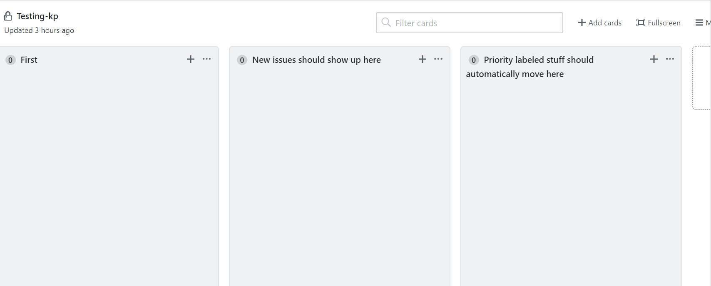

# Actions-AddNewIssueToColumn

This action automatically adds issues or pull requests to a specific column in a project. A new project card gets created that references the issue or pull request if it doesn't already exist. 

The project can be configured at the repository level or at the org level. This action allows you to create new types of automations that are not currently supported with project boards and issues.

### Demo

This demo shows a new issue called "Demo Issue" that automatically gets added to column in a project after being created.



### Create a PAT with the appropriate permissions

You have to use a custom token that has repo access when using a repository project board or `read:org` access if using an organization project board. You can add the PAT as a secret in the repository settings page and use it instead of `secrets.GITHUB_TOKEN`. The token that is normally passed in does not have permissions to search projects to get the appropriate column id so it will fail with a `Resource not accessible by integration` error.

- Create a new personal access token with the appropriate permissions at https://github.com/settings/tokens
- Add the personal access token to your repository secrets: https://github.com/organization_name/repository_name/settings/secrets (for an organization), https://github.com/repository_owner/repository_name/settings/secrets (for a standard repository), and remember the name
- Use the newly saved token in your YAML file as input for `action-token`. In the example above, it is called `Access_token`

### Inputs

| Input | Required | Description |
|-------|----------|-------------|
| `action-token` | Yes | A token with permissions to use repository or oraganization project board. |
| `project-url`  | Yes | The full url of the GitHub project board. Ex. https://github.com/orgs/github/projects/1 |
| `column-name`  | Yes | The name of the project board column where the issue or pull request should be added. |

### Example workflow YAML

Example YAML workflow that will run whenever a new issue has been opened. The new issue that causes the workflow to run will be added to the specified column:

```name: "New Issue Automation"
on:
  issues:
    types: [opened]
jobs:
  Add_New_Issue_To_Project:
    runs-on: ubuntu-latest
    steps:
    - uses: konradpabjan/actions-add-new-issue-to-column@v1.1
      with:
        action-token: "${{ secrets.Access_token }}"
        project-url: "https://github.com/orgs/github/projects/1"
        column-name: "New issues should show up here"
 ```

The project-url can be a repository project with a format like: `https://github.com/konradpabjan/example/projects/1` or a project linked at the org level with the following format: `https://github.com/orgs/exampleOrg/projects/1`

### Conditionally running the workflow for issues or pull requests

You can select which events trigger this action using the `on` workflow syntax. For example, starting a workflow file with the following YAML syntax will trigger the workflow when issues or pull requests are opened and reopened.

```
on:
  issues:
    types: [opened, reopened]
  pull_request:
    types: [opened, reopened]
```

If your workflow triggers on both `issues` and pull_requests` but you'd like to limit a step to run on one of the events, you can use an `if` conditional.

For example, if you had two separete project columns for issues and pull requests your workflow might look like this:

```
on:
  issues:
    types: [opened, reopened]
  pull_request:
    types: [opened, reopened]
jobs:
  Add_New_Issue_To_Project:
    runs-on: ubuntu-latest
    steps:
    - name: Triage pull requests
      if: github.event_name == 'pull_request'
      uses: konradpabjan/actions-add-new-issue-to-column@v1.1
      with:
        action-token: "${{ secrets.Access_token }}"
        project-url: "https://github.com/orgs/github/projects/1"
        column-name: "New pull requests should show up here"
    - name: Triage issues
      if: github.event_name == 'issues'
      uses: konradpabjan/actions-add-new-issue-to-column@v1.1
      with:
        action-token: "${{ secrets.Access_token }}"
        project-url: "https://github.com/orgs/github/projects/1"
        column-name: "New issues should show up here"
 ```
